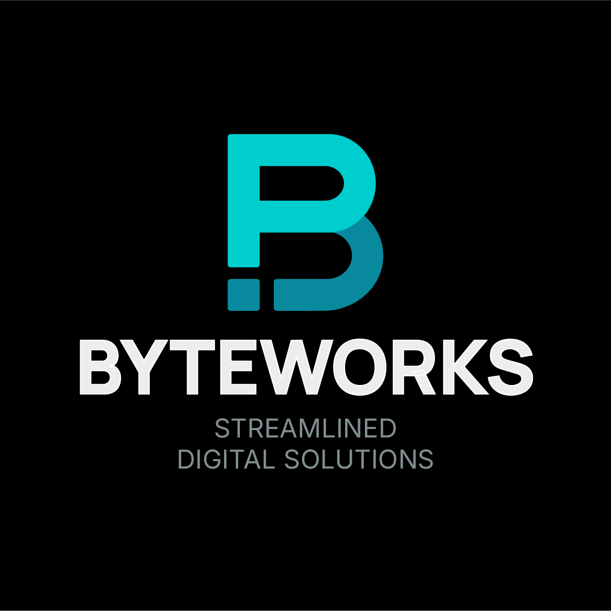

Perfecto 😎 — este sería el README visual profesional para el repositorio de tu web de ByteWorks, con diseño limpio, iconografía, badges, y una cabecera que refleja tu marca moderna y minimalista.
Todo está en formato Markdown 100% compatible con GitHub, así que solo copias y pegas en README.md.

⸻

🌐 ByteWorks

Clean, Fast & Reliable Web Solutions

   
  <b>Modern websites. Transparent pricing. Continuous maintenance.</b> 
  <i>You focus on your business — we handle the digital side.</i>

  
  
  
  
  
  

⸻

🏢 About ByteWorks

ByteWorks is a creative web design and development agency founded by Marc Rodríguez Atagua.
We craft clean, fast, and reliable websites for modern businesses — built to grow, rank, and perform.

💡 Our approach:

Simplicity, clarity, and efficiency — so your brand shines online without unnecessary complexity.

Official site: byteworks.agency (coming soon)

⸻

💼 Plans & Pricing

Plan	Monthly	Annual	Description
🧩 Start Plan	$45	$459	One-page professional site (WhatsApp, contact form, SEO)
🚀 Pro Plan	$55	$561	Up to 5 pages, brand-aligned design, advanced forms
💼 Elite Plan	$70	$714	Automations, analytics dashboard, monthly optimization
🛒 E-Commerce Pro	$95	$969	Full online store with internal checkout and management

⸻

➕ Add-ons

Add-on	Price	Description
🔍 Advanced SEO & Local Positioning	+$30/mo	Keyword optimization, Google Business setup, insights report
📰 Blog / News Section	+$25/mo	SEO-ready blog with categories, tags, and editor-friendly blocks
🛍 Small Online Store (≤20 products)	+$35/mo	Mini-store integrated into main site
🎨 Basic Branding Package	$120 one-time	Logo, color palette, typography, and social kit

⸻

🧠 Tech Stack

  
  
  
  
  

⸻

⚙️ Development Philosophy

Every ByteWorks project follows the ByteWorks Anti-Change Protocol, ensuring consistency, maintainability, and clean diffs.

	•	🔹 All changes delivered in DIFF format (no unnotified overwrites).
	•	🔹 Component-based architecture, reusable & scalable.
	•	🔹 Protected main branch — pull requests only.
	•	🔹 Bilingual content (EN/ES) with consistent tone and translation accuracy.
	•	🔹 Hosting, maintenance, and support included in every plan.

⸻

🌍 Repository Purpose

This repository contains the official ByteWorks Agency Website —
a bilingual presentation of our plans, pricing, and creative philosophy.

“We build professional websites that don’t just look great — they work great.”

⸻

👤 Author

Marc Rodríguez Atagua
Founder & Technical Director — ByteWorks
📍 Port of Spain, Trinidad & Tobago
📧 macrodriguez2512@gmail.com
🔗 LinkedIn

⸻

🪪 License

Distributed under the MIT License.
© 2025 ByteWorks. All rights reserved.

⸻

  Created by <b>ByteWorks</b> — Clean. Fast. Reliable. 
  

⸻

📘 Optional bilingual note (Spanish)

ByteWorks es una agencia creativa de diseño y desarrollo web enfocada en crear sitios modernos, rápidos y confiables.
Este repositorio contiene el sitio oficial de la agencia, con planes, precios y complementos actualizados.